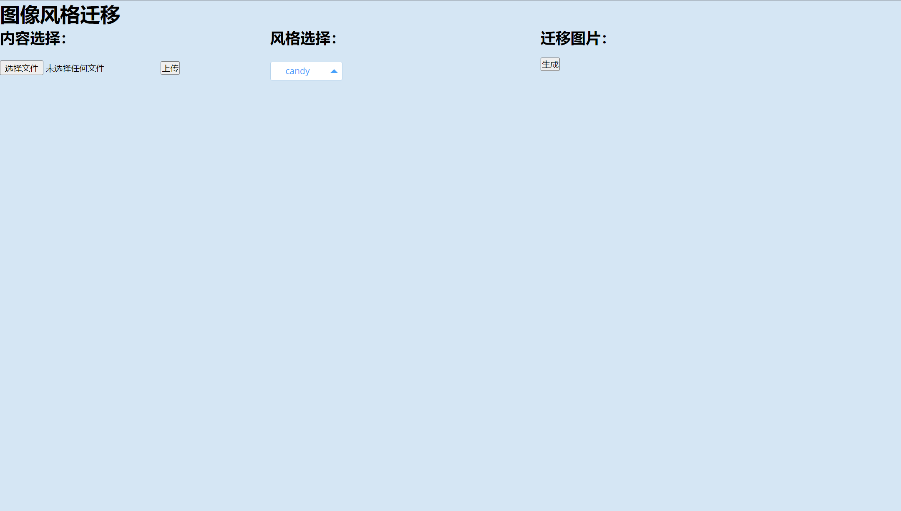

# neural-style	

## Requirements

The program is written in Python, and uses [pytorch](http://pytorch.org/), [scipy](https://www.scipy.org). We suggest you using GPU to run our code. And you'd better have the following computer configuration:

- Memory > 16GB
- Video Memory > 8GB

## Usage

Stylize image

```
python neural_style/neural_style.py eval --content-image </path/to/content/image> --model </path/to/saved/model> --output-image </path/to/output/image> --cuda 0
```

* `--content-image`: path to content image you want to stylize.
* `--model`: saved model to be used for stylizing the image (eg: `mosaic.pth`)
* `--output-image`: path for saving the output image.
* `--content-scale`: factor for scaling down the content image if memory is an issue (eg: value of 2 will halve the height and width of content-image)
* `--cuda`: set it to 1 for running on GPU, 0 for CPU.

Train model

```bash
python neural_style/neural_style.py train --dataset </path/to/train-dataset> --style-image </path/to/style/image> --save-model-dir </path/to/save-model/folder> --epochs 2 --cuda 1
```

There are several command line arguments, the important ones are listed below

* `--dataset`: path to training dataset, the path should point to a folder containing another folder with all the training images. I used COCO 2014 Training images dataset [80K/13GB] [(download)](https://cocodataset.org/#download).
* `--style-image`: path to style-image.
* `--save-model-dir`: path to folder where trained model will be saved.
* `--cuda`: set it to 1 for running on GPU, 0 for CPU.

Refer to ``neural_style/neural_style.py`` for other command line arguments. For training new models you might have to tune the values of `--content-weight` and `--style-weight`. The mosaic style model shown above was trained with `--content-weight 1e5` and `--style-weight 1e10`. The remaining 3 models were also trained with similar order of weight parameters with slight variation in the `--style-weight` (`5e10` or `1e11`).

# Folders

In`fast_neural_style` you can use the instructions mentioned above to train your model or merge two pictures.

If you want to enjoy our web application, visit `pic_web_demo` and run `app.py`. Its surface is just like the following figure.

